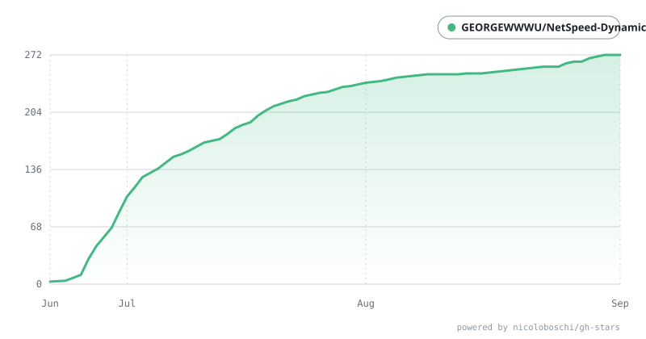

<div align="center">


<h1>NetSpeed Dynamic Pro</h1>
<p>专为 Windows 而生的灵动岛</p>

[](https://tauri.app)
[](https://rust-lang.org)
[](https://vuejs.org)
[](https://www.typescriptlang.org)
[](https://vite.dev)
[](https://echarts.apache.org)

[简体中文](./README.md) &nbsp; | [English](./README.en.md) &nbsp; | [下载地址](https://github.com/GEORGEWWWU/NetSpeed-Dynamic/releases/latest) &nbsp; | [官方网站](https://nsd.georgewu.top/) &nbsp; | [QQ群：1080730621](https://qm.qq.com/cgi-bin/qm/qr?k=i70z7rbl-VWpejQugvlXeARDUjwP7sIW&jump_from=webapi&authKey=b6Pj6zLuuCINDhafPJRttePdy3D45vvtWzcZ109LWoWYXkcKo8bNWI7fMhr+yV87)

</div>


---

NetSpeed Dynamic Pro（NSD）是一个基于 Tauri 2、Vue 3、TypeScript 与 Rust 构建的 Windows 桌面应用。它将 “实时网速监控、系统资源观察、音乐控制、系统通知、任务栏插件与个性化配置” 封装在一个悬浮式 Dynamic Island 中，旨在为桌面环境提供更轻量、更顺手的状态展示与交互体验。

---

# 自家广告位
👉 为了极致的性能优化和内存管理，我使用 C# + Skia 新开了一个刘海屏/灵动岛项目：[https://github.com/GEORGEWWWU/NotchPeninsula](https://github.com/GEORGEWWWU/NotchPeninsula)，实测内存占用 20-30 mb 上下！吊打Webview，体验上也不用担心，目前项目在持续开发中，感兴趣的小伙伴可以点亮一个 Star 支持一下！也非常感谢所有使用 NSD 的小伙伴，我爱你们。


## 项目亮点

- 实时展示上传/下载网速，并提供本地流量统计、月度累计与趋势图
- 使用悬浮式 Dynamic Island 展示网络、音乐、消息、CPU/RAM 资源和系统状态
- 支持多平台音乐控制，兼容 Windows SMTC 与多种媒体会话与应用包名识别
- 拦截并展示系统 Toast 通知，并支持静默模式、优先级处理与点击打开应用等交互
- 提供亮色、暗色、沉浸模式、透明度、圆角、全局缩放、歌词延迟、流光边框、音频频谱等配置
- 支持开机自启、托盘图标、任务栏插件、FPS 插件、全屏自动隐藏、位置锁定、置顶等桌面增强能力

## 核心功能

### 1. 网络监控

- 每秒刷新上传/下载速度，并自动换算单位
- 显示网络状态灯：正常 / 高延迟 / 断网
- 提供本地累计流量统计与按月统计图表
- 支持在控制台中切换柱状图与折线图视图
- 结合双地址断网检测与高流量波动分析，减少误报
- 同步到任务栏插件，确保网络状态在桌面侧边栏也可观察

### 2. 多平台音乐控制

- 通过 Windows SMTC API 进行上一首 / 播放暂停 / 下一首控制
- 兼容网易云音乐、Spotify、Apple Music、QQ 音乐、酷狗音乐、Echo Music、LX Music、JustSolo 等媒体来源
- 针对浏览器SMTC播放提供了浏览器Pro模式，使用了对主流视频平台+主流音乐平台进行关键词识别的机制，并运用正则表达式匹配窗口标题，以获取准确的歌曲信息和歌手，实现对浏览器SMTC的精确识别。（使用请确认所有浏览器一共只打开一个窗口。本功能仅对Edge、Chrome浏览器做测试以及适配，当前为beta版本。如有误判情况，欢迎在QQ群或Github Issue、腾讯文档里反馈）
- 自动识别当前媒体会话，并优先读取 SMTC 本地封面
- 支持封面兜底、歌词请求、歌词同步、歌词延迟调节与播放进度展示
- 运行中支持播放状态切换、封面旋转、歌曲信息切换与歌词动画

### 3. 系统通知与事件

- 接收系统 Toast 通知，并在 Dynamic Island 中呈现消息卡片
- 支持消息通知筛选、静默模式、优先级处理与点击打开应用等交互
- 监听系统音量变化、电源插拔、锁屏/解锁、低电量等事件
- 根据事件类型切换独立图标、颜色与通知样式
- 可在主题、透明度、边框、尺寸和显示组合中统一管理这些事件信息

### 4. 任务栏组件与桌面集成

- 提供任务栏插件能力，可将实时网速、歌词、消息与资源信息同步到任务栏侧边组件
- 支持 FPS 插件，以独立窗口方式展示帧率信息
- 支持通过托盘图标快速打开或关闭界面
- 支持全屏自动隐藏，避免游戏或视频观看时干扰
- 支持动态岛位置锁定、重置、流光边框开关、始终置顶和多种边框样式

### 5. 个性化中心

- 支持亮色、暗色、沉浸模式、透明度、圆角、全局缩放等统一设置
- 提供“动态与物理反馈”调节：快速 / Q 弹两种弹性动画风格
- 支持尺寸边界控制：常规宽度、高度、媒体卡片宽度、消息卡片宽度、音乐常态宽度
- 支持自定义显示组合：网速、资源、FPS、封面可按需组合排列
- 可配置任务栏组件、歌词延迟、流光边框、主题色与系统语言

### 6. 音频频谱与视觉效果

- 采集系统输出音频并进行 FFT 分析，生成 7 段动态频谱柱
- 对称“山丘”分布，适合搭配音乐场景进行视觉增强
- 频谱数据作为动画驱动源，可与灵动岛、流光边框、封面玻璃效果协同表现

## 技术栈

| 层级 | 技术 |
|------|------|
| 桌面框架 | Tauri 2 (Rust) |
| 前端框架 | Vue 3 + TypeScript |
| 构建工具 | Vite 6 |
| 路由 | Vue Router 5 |
| 图表 | ECharts 6 |
| 图标 | Lucide Vue Next |
| 网络监控 | sysinfo (Rust) |
| 异步运行时 | Tokio (Rust) |
| HTTP 客户端 | reqwest (Rust) |
| 媒体控制 | Windows SMTC API |
| 音频处理 | cpal + realfft |
| 系统事件 | Windows COM / WinAPI |
| 任务栏通信 | WebSocket + Tauri command |
| 存储 | localStorage |

## 项目结构

```text
NetSpeed-Dynamic/
├── src/                           # 前端源码
│   ├── App.vue                    # 根组件
│   ├── main.ts                    # 应用入口
│   ├── i18n.ts                    # 中英文国际化
│   ├── router/
│   │   └── index.ts               # 路由配置
│   ├── views/
│   │   ├── MainPanel.vue           # 主控制台界面
│   │   └── WidgetIsland.vue        # 灵动岛悬浮窗
│   ├── components/
│   │   └── DynamicSet.vue          # 个性化中心
│   └── assets/                    # 图标、截图与静态资源
├── src-tauri/                     # Tauri Rust 后端
│   ├── src/
│   │   ├── lib.rs                  # 核心逻辑、窗口、动画、托盘与插件
│   │   ├── music_controller.rs     # 媒体控制、封面、歌词与 SMTC
│   │   ├── notification.rs         # 系统通知捕获
│   │   ├── system_events.rs         # 音量、电源、锁屏等系统事件
│   │   └── audio_spectrum.rs       # 音频频谱分析
│   ├── Cargo.toml                 # Rust 依赖
│   ├── tauri.conf.json            # Tauri 配置
│   └── icons/                     # 图标资源
├── package.json                   # 前端依赖与脚本
├── README.md                      # 中文说明
├── README.en.md                   # 英文说明
├── LICENSE                        # MIT License
└── .github/                       # GitHub 工作流与 Star 历史资源
```

## 开发环境

### 依赖要求

- Windows 10/11
- Node.js 18+
- Rust 1.70+
- Tauri 2 CLI

### 安装与运行

```bash
git clone https://github.com/GEORGEWWWU/NetSpeed-Dynamic.git
cd NetSpeed-Dynamic
npm install
npm run tauri dev
```

### 构建发布

```bash
npm run tauri build
```

构建产物会输出到 `src-tauri/target/release/bundle/`。

## 使用方式

1. 启动应用后，主控制台会弹出实时网速与设置入口。
2. 打开“Widget”开关后，屏幕顶部会显示可拖拽的 Dynamic Island 悬浮窗。
3. 左键拖拽移动，右键菜单可进行位置锁定、重置、关闭、流光边框开关与置顶设置。
4. 在控制台中配置媒体平台、消息通知、主题、透明度、自动启动、任务栏插件和 FPS 插件。
5. 进入“个性化中心”后，可以调整物理反馈、边框样式、尺寸、缩放比例、歌词延迟和显示组合。

> 说明：当前项目针对 Windows 平台深度适配，部分能力依赖系统 SMTC、WinAPI、COM、Notification Manager 与任务栏插件接口。

## 许可证

MIT License

Copyright (c) 2026 Ryen (GEORGEWU)

## 贡献者与 Star 历史

感谢所有为本项目做出贡献的开发者！

<div align="left">
  <a href="https://github.com/GEORGEWWWU/NetSpeed-Dynamic/graphs/contributors">
    
  </a>
</div>

### Star 历史趋势

<div align="center">
  
</div>

## 支持与捐赠

如果这个项目对你有帮助，欢迎支持作者：

| 方式 | 信息 |
|------|------|
| 微信支付 | [微信](./src/assets/wechat-pay.png) |
| 支付宝 | [支付宝](./src/assets/alipay.jpg) |
| GitHub Sponsors | [前往支持](https://github.com/sponsors/GEORGEWWWU) |

---

> 感谢每一位支持者与使用者！
